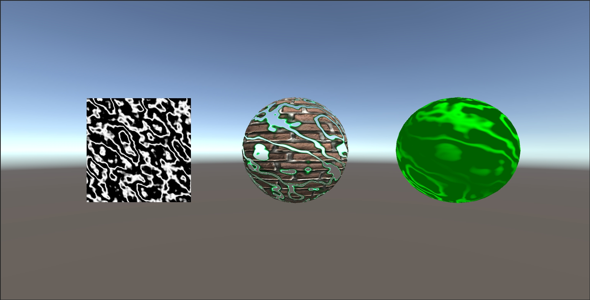

# ノイズ

* 左の四角形のテクスチャにノイズを書き込もう
* ノイズを使って、ディゾルブエフェクトを球に反映させよう
* パラメータ、テクスチャを差し替えてかっこよくしよう
* パラメータ、テクスチャを差し替える以外の拡張を考えよう

# 自分なりに変更した点

-画面右側のものにノイズをノーマルマップとして適用し、その他のテクスチャを調整して立体感を出そうとしてみました。
-
-
-

# 進め方

- 本リポジトリをフォークしてください
- フォークしたリポジトリをcloneします
- Unityのプロジェクトを更新して実装してください。
- このテキストファイルに変更点を記載してください
- result.pngを自分の結果を保存して差し替えてください
- プルリクエストを出して提出してください
